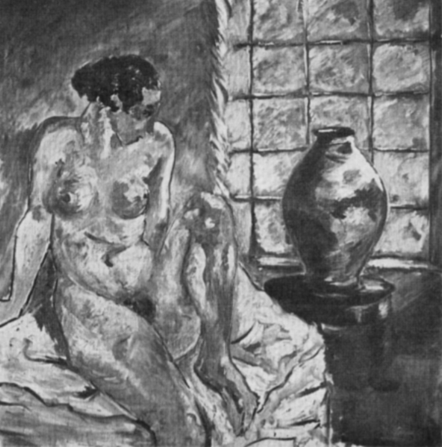

---
title: Why do we paint?
author:
- name: Maarten Steenhagen
  affiliation: university of antwerp
  email: maarten.steenhagen@uantwerp.be
date: 2016
abstract: "Why do we paint? Psychoanalysis is a motivational psychology: it helps us make sense of why we do what we do. Psychoanalytic theory of the arts in general, and psychoanalytic accounts of the pictorial arts more specifically offer the outlines of an answer to the question why we paint. That answer, if accepted, sheds light not only on why people value painting, but also on what painting is. In this way psychoanalytic approaches to painting may be thought to inform a philosophical account of pictorial representation. In this paper I present a psychoanalytic account of why we paint, and argue for its significance for the philosophy of art."
...

Over the past few years I have been working on depiction and pictorial representation. I particular, I have studied different ideas about how pictures figure in our experience of the world. Are they windows? Are they mere symbols? I have become particularly concerned with what data we can draw on to decide between rival philosophical conceptions of painting and painterly representation. 

In this paper I will discuss the relation between psychoanalysis and philosophy. In particular, I will consider how a psychoanalytic theory of the pictorial arts could inform, or even constrain, a philosophical account of those arts. It could tell philosophers what they should and should not believe about those arts. 

Here’s my suggestion. I argue that psychoanalytic theory is able to tell philosophy something interesting. I think psychoanalysis can help clarify the nature or concept of the pictorial arts, by revealing something about the motivations behind making art. My main aim today is to identify a distinctively psychoanalytic conception of why we paint, and argue that it is of importance to how to think about representational painting.

# Plan of the paper

Let me say more precisely what I will do. 

In philosophy, there is a standing puzzle about how pictures represent. It is a completely general puzzle. It is about gallery painting, the portraits on postage stamps, and doodles in the margins of notepads. It is a question about what pictorial representation as such is. It is a metaphysical or conceptual question, depending on how deep you think philosophy digs. It is on a par with philosophical questions like ‘What are promises?’, ‘What is a person?’, and ‘What is justice?’.

Psychoanalytic writers, on the other hand, have been much more concerned with the question why we paint. Why have human beings throughout history felt an urge to spend time and resources marking surfaces in such a way that they represent specific scenes, objects, or events? That is a motivational question. It’s on a par with questions like ‘Why do we promise things?’ and  ‘Why do people fight for justice?’. 

I want to show how the answer that some psychoanalytic writers give to the motivational question of why we make representational paintings, tells us something about how to respond to the metaphysical or conceptual question what representational painting is. That’s the plan. 

There is no need to make this into a detective story, so I will just tell you up front what my conclusion will be. 

The big philosophical disagreement over the nature of the pictorial arts, as I’ll explain in a minute, is over whether pictorial representation is an exclusively semantic phenomenon, or whether it depends on experience of what a picture represents. I will argue that at least one refined attempt to answer the motivational question of why we paint – found in the writings of Adrian Stokes – points strongly in the direction of the latter, experiential answer. We paint in order to restore or repair a damaged, disrupted or shattered inner world. 

That is the relevant motivation that explains why human beings throughout history felt an urge to spend time and resources marking surfaces in such a way that they represent specific scenes, objects, or events. And Stokes shows how these acts of reparation, though complex, are at root constituted by phantasies of identification and introjection of the specific scenes, objects, and events represented in a painting. Such phantasies require experience of their objects. 

And that gives me my conclusion: psychoanalytic theory tells philosophy that pictorial representation cannot be an exclusively semantic phenomenon, but must at least in part depend on the experience of the objects or scene a picture represents.

Let me unpack this line of thought.

# The Philosophical Puzzle of Depiction

Because I want to make claims about the psychoanalytic and the philosophical approach to painting, I need to say a bit more about both. 

I will begin with the philosophical approach. In particular, I need to explain what philosophers in recent decades have found particularly puzzling about the pictorial arts and their relation to vision. 

When I talk about the pictorial arts, I intend to include a variety of art forms, ranging from cave painting to easel painting, from live drawing to sketches made with pen or charcoal on paper. What is distinctive about most of these practices, especially when they are carried out as an art form, is their representational character. 

Note, I mean by this to include the schools of abstract painters. Most abstract painting is representational too, be it in a potentially minimal or, indeed, abstract way. A simple example: an abstract work may present us with two overlapping shapes. But of course the painting itself need not contain any actual overlap. The overlap is represented. 

So let’s suppose that pictures represent something or other. We may now find that they do so in a distinctively pictorial way. Or that at least is the consensus among philosophers. 

Many people have observed the contrast between pictorial representation and language. The written phrase ‘a basket of strawberries’ and a picture of a basket of strawberries are different things. They look different. And if both of them represent or refer to a basket of strawberries, they do so differently. If we consider how each points us to a basket of strawberries, we need to admit that the picture does so in a completely different way than the linguistic phrase. 

So far all this should be obvious. But what exactly is the difference? Here I am not concerned with telling you how language pulls it off. What I am interested in is how pictures do it. How do pictures represent? 

The issue is controversial. There is a fundamental disagreement that has divided philosophers of art and perception in recent decades. This disagreement comes into view clearly when considering something Richard Wollheim wrote.

> It is surely a ground level observation about the difference between pictorial and linguistic representation”, Wollheim writes, “that, though, if we are to understand a linguistic representation of x, it suffices for us to have a thought of x, we must, if we are to understand a pictorial representation of x, have an experience of x. (2003: 137)

This passage is from a paper Wollheim gave to the Joint Session of the Aristotelian Society in 2003. The paper is titled ‘What makes representational painting truly visual’? 

Wollheim here is in dialogue with Robert Hopkins. Both are interested in the metaphysical question what pictorial representation is. Hopkins thinks that pictures represent via resemblance. A picture represents a fox, say, only because some part of the painted surface looks like a fox, or like that part of a fox we get to see when we look at the animal from a specific point of view.  

Wollheim resists this. He thinks pictures open up an experience of whatever they represent. To represent a fox in a picture just is to produce something that offers us an experience of a fox. Mere resemblance won’t do. Hopkins places our understanding of pictorial representation on a par with appreciating that John looks like his father. You can appreciate that John looks like his father without having an experience of John’s father when you do so. It suffices for John’s distinctive complexion to bring to mind the thought that his father looks like that. 

Yet in order to appreciate that a picture represents a specific scene, Wollheim thinks, it is not sufficient to think something like ‘that looks like a basket of strawberries’. What is needed, he thinks, is an experience of a basket of strawberries. We need to be able to experience what the picture represents, and see what the picture represents as a basket of strawberries. 

A problem here is that, though Wollheim calls it a ground-level observation, it is not clear that it is. Many philosophers have voiced their disagreement with Wollheim. Most of these have claimed that it is simply not obvious why we need to accept his requirement of experience. They think that we can explain the significance of painting, whether cognitive or aesthetic, perfectly well in terms of experience of picture itself, and the subsequent thoughts, beliefs, and inferences we come to have when we see that picture. There is no need over and above that to posit the additional experience of the scene the picture represents.

So we have here a deep dispute over the nature of pictorial representation. It is a dispute about what representation is: is it a purely semantic property of a picture, or is it the externalisation of an experience. What Wollheim writes makes it seem as if there is little room for argument here. But as I will show now, there is a good way to defend his assumption. 
 
# Painting and Reparation

For the moment that is enough philosophy. I now want to consider the attention that has been paid to representational painting by psychoanalytic writers. 

But before that, I should say something about how I understand psychoanalysis itself. This because I can help us to understand better the kind of engagement with painting that we may expect from psychoanalytic writers. 

Psychoanalytic psychology is a motivational psychology. It is a theory designed to explain and render intelligible seemingly incoherent or meaningless bodily or mental activity, and the satisfaction people seem to take in those activities. That psychoanalytic psychology is a motivational psychology is clear both in its clinical theory and the metapsychological concepts in its background. Think of how psychoanalytic theory is able to explain obsessive behaviour in terms of unconscious phantasy, or slips of the tongue in terms of repression and desire. 

This suggests that if psychoanalytic writers feel a reason to deal with painting at all, it is likely because painting presents some sort of motivational puzzle. And that is precisely what we find. The discussions about painting we find in the psychoanalytic tradition are not triggered by puzzlement over ‘what painting is’, but are fed by puzzlement over why people do it in the first place. Why do so many people feel an urge to paint, and why do they gain satisfaction from doing so?

Now, of course there are countless motivations someone could have to paint. Many of these are not deep at all. Someone could work on commission, for example. Or they could paint because they want to imitate someone they look up to. The question ‘Why do we paint?’ can be given at least as many answers as there are different motivations. 

But the point is that psychoanalytic answers to motivational questions are genuinely informative about an entire practice or form of behaviour. Psychoanalytic psychology is able to give general explanations for why people engage in certain types of activities. As I will show now, the motivation psychoanalysis identifies behind painterly activities makes sense not only of why this or that painting was made; it sheds light on the very institution of painting as an aesthetic practice. It explains why painting is pursued by people as an art.

Painting has never taken a central place in psychoanalytic theory. Freud himself hardly talks about painters, and he certainly doesn’t develop anything like a psychoanalytic theory of the pictorial arts.

Perhaps this is a mere historical contingency. Freud wasn’t fascinated by painting in the way he was fascinated by the literary arts. His strong interest in classical tragedy, mythical stories and novels led him to cast a number of the founding psychoanalytical ideas in a literary mould. The Oedipal conflict is modelled on a tragic plot; dreams are conceived primarily as narratives; and the basic principles of the dream work are, as Lacanians will continue to remind us, easily understood as psychic analogues of literary transformations. 

An early attempt at a psychoanalytic discussion of painting was made in this country by writers such as Marion Milner, Hanna Segal, and Adrian Stokes. The emergence of this discussion owes much to Melanie Klein. Klein had an instrumental role in supplying the conceptual framework for a distinctively psychoanalytic account of representational painting. This was not the least because she analysed Adrian Stokes, who went on to become one of Britain’s leading art critics of the twentieth century.

The core idea of all these writers is that artists work in order to make reparation. In 1929 Melanie Klein writes a short paper in which she sets out this general idea. Besides discussing a work of opera, Klein considers the moment at which the Danish painter Ruth Kjär began to paint.

It happened, we read, because Kjär (better known as Ruth Weber) couldn’t stand the emptiness of a piece of wall. A painting had just been removed from it, as it was sold. They were art dealers. Kjär feels a strong urge to fill the space, a space which according to Klein reflects the emptiness she feels inside her. Klein suggests that destructive phantasies directed at inner objects have left her inner world gappy and desolate. Painting becomes an externalisation of phantasy of repairing her inner world. As Klein writes, “It is obvious that the desire to make reparation, to make good the injury psychologically done to the mother and also to restore herself was at the bottom of the compelling urge to paint…” (1929, p. 443)

Here we get the gist of a distinctively psychoanalytic answer to the question why we paint. It leaves much unanswered. How can painting do this? What is the significance of filling the empty wall or canvas? How do we fill it? And how can filling that space help us? It is only in the work of other writers that these questions get taken up. Here I will focus on what is arguably the most detailed and extensive body of writing on this topic available, the essays of Adrian Stokes. 

# Adrian Stokes 

I already mentioned that Stokes was one of Klein’s patients. In a recent biography, which I can strongly recommend, Janet Sayers has brought out how Stokes and Klein seem to have talked about the arts and about painting a lot. The motivational question may have become pressing in making sense of Stokes’ own problems and psychological conflicts. I think we may speculate that the resulting understanding of why Stokes painted lead him to develop a more general psychoanalytic answer to the question why we paint. It is a much more refined version of the Kleinian suggestion that we paint in order to restore. 

Stokes’s answer is based just as much on his experience as an art critic. He himself emphasised that, for he must have realised that no adequate theory of art can be founded on mere theoretical speculation, or on his individual ‘case history’ alone. Stokes was already a renowned art theorist at the start of his analysis. Born at the turn of the century in 1902, he continues a tradition of art writing going back to Ruskin and Pater. His first book, The Thread of Ariadne, is a juvenile but more or less worked out theory of art. It came out 4 years before Klein published her exploratory article on the painting of Kjär. So when he begins his treatment with Klein in 1930, the core of his art theory is already in place. 

His encounter with psychoanalysis does however allow him to connect the earlier developed ideas about art forms and styles with a motivational psychology that, Stokes thinks, profoundly deepens that art theory. 

It is probably best to approach Stokes’ mature, psychoanalytic account of art by plunging right into it.

In ‘The Invitation in Art’, a late essay Stokes published in 1965, he justifies his application of the concept of projective identification to our engagement with works of art. 

He takes it to be obvious that the aesthetic value we attribute to any particular work of art in part depends on past experience with other valuable works. It is a well-established art historical principle that one’s assessment of any work will be coloured by one’s past experience with works of a comparable kind. The way we look at a painting by Poussin is likely to be influenced by our previous encounters with landscapes by Claude.

Stokes’ own example here is provocative. Duchamp’s Fountain. When we look at Duchamp’s deadpan urinal, we cannot but draw on our past experience of magnificent Baroque marbles, of delicate porcelain artefacts, and of the sublimity of religious art placed at the centre of altars and in cathedrals.

But, Stokes asks us, isn’t the significance of all these encounters with art – past and present – due to their association with experiences of our own mind? Stokes’ idea is that though the value of the individual work may depend on our evaluation of other works, the value of art as such seems to have a deeper origin. 

Stokes offers an hypothesis. He thinks that the significance people ascribe to art finds its origin in our identification of aspects of ourselves with aspects of the experience we have of art. And, he says, this hypothesis 
    
> seems even more likely since psychoanalysis uncovered a mechanism called projective identification by which parts of ourselves or of our inner objects may be attributed even to outside objects that, unlike artifacts, at first sight seem inappropriate for their reception. (IA, 101)

Stokes thinks that our aesthetic encounter with works of art and the significance we find in such works is to be explained in terms of the psychic mechanism of projective identification. Projective identification is a phantasy in which we experience parts of the self as being ejected into the external world, into some other person or thing. It enables us in that way to feel one with the person or thing that is now experienced as containing a part of our inner life.  

By understanding our encounter with art as relying on projective identification, Stokes is able to refine Klein's answer in terms of reparation. He says something about the psychic mechanisms that are at work in the creative or aesthetic engagement with works of art. “The artist is under compulsion to repair the inner world in terms of co-ordinating projections upon the outer.” (p. 210)

Not only does Stokes refine the Kleinian account by identifying the mechanism of reparation, he also identifies its materials more precisely. Form. “Form in art,” he writes

> reconstitutes the independent, self-sufficient, outside good object, the whole mother whom the infant should accept to be independent from himself, as well as the enveloping good breast of the earliest phase, at the foundation of the ego, the relationship with which is of the merging kind. In this reparative act the attempt must be made to bring less pleasing aspects of these objects to bear, parallel with the integrative process in the ego as a whole that art mirrors no less. (p. 211)

Stokes’ point here is that the reparative function of art exploits not so much the work's subject matter, but the interrelation and unity of the part-elements that make up the work of art as a whole object of experience. 

It is an old idea that form in art can be a source of delight. Stokes offers a psychoanalytic explanation of that delight. The work can appear to us to be a good object, something suitable for introjection or incorporation into oneself. The work resulting from a creative process can invite its maker to introject the repaired object, potentially leading to an improvement of how they experience their inner world. 

The spectator is able to appreciate this process to the extent she is able to follow the artist's activity as it is deposited in the work. She can identify with the creative activity, as Stokes puts it.

Stokes’ hypotheses, if correct, make a crucial contribution to a clinical understanding of projective identification. As it was introduced and used by Klein herself, projective identification was primarily a defence mechanism, and a sign of pathology. Later writers have urged that the mechanism has a positive contribution to make as well, serving communication and curiosity. Stokes’ account of reparation in art bears that out. If he is right about how projective identification figures in the reparative function of art, paving the way for introjective phantasies that benefit one's inner life, then he has identified benign aesthetic purpose to projective identification.

# Significance and Pictorial Organisation

So far I have only considered Stokes’ art theory at a very general level, as a theory that gives a psychoanalytic explanation for why people produce and engage with works of art. But Stokes has distinctive ideas about what is valuable about the specific art forms. I need to say in a little more detail how he thinks representational painting facilitates the dynamic of projection and introjection we just encountered. 

In particular, in what follows I want to bring out how the projective identification Stokes regards so important for the reparative function of art would work in the case of representational painting. In representational painting, projective identification typically draws on the specific spatial qualities and relations opened up by a pictorial representation.

Stokes comes to a psychoanalytic theory of the pictorial arts only after having written extensively on architecture, sculpture, and the ballet. His first book-length treatment of painting is Colour and Form, from 1937. But there are many more later essays that deal specifically with representational painting.

The core of what Stokes deems distinctive of the pictorial arts is formed by its distinctive formal possibilities: the organisation of objects in a pictorial space. I will call this pictorial organisation. The painter, in sketching and applying paint, crafts opportunities for her to project onto the material of the work aspects of her inner world. But the way she prepared the canvas is not random. Her process of projection by means of paint is far from haphazard. It is orchestrated. A painter will continuously revise and adjust the resulting representation in light of the work's overall appearance. 

Here we have a process of organisation, placement, and rearrangement that, because it happens under the aegis of projective identification, turns an otherwise purely psychological quest of integration into a corporeal and bodily activity of applying paint and observing the results. However dark or hostile some of the projected material may still come out,  it is by painting and over-painting that these part-objects ultimately settle into a place that is acceptable. The work becomes good enough, to use a term of the analyst Donald Winnicott. 

The place in which these projected objects are experienced is the represented space of the picture. Stokes writes that through this pictorial rendering of inner objects, “they are enthroned by the artist by means of a pictorial settlement wherein they may surrender themselves only to that multiform composition which symbolizes the integrated elements of the self no less than of the other person.” (RN, p. 326) The represented space of the picture becomes a container for both good and bad objects. As Stokes writes, “so as to figure forth a pattern wherein confusion, though it be rehearsed there, may not rule; and greed and sadistic control of the object, though they too may figure, are not unchallenged.” The work may be conflictual, but the very fact that the pictorial space can be experienced as containing all these separate objects, gives the work a wholeness in which we can delight. 

To make this more concrete, let me present a brief but detailed analysis by Stokes of a painting by the seventeenth century Dutch landscape painter Meindert Hobbema. These will mostly be Stokes’ own words on the painting. 

Of Hobbema’s Brederode Castle, Stokes writes that it is perhaps the best painting to bring out how landscape painting enables us, though we are “scanning the open, the distant”, to attend to an interior scene, to an aspect of the inner life. 

> This castle landscape, stepped from blue to red, to the dark bank, to the pink ruin and to the incontinent clouds like the disordered roof of a case, is yet so softly and closely organized that the castle may seem to have the function of a high alter at a cathedral’s end or, more simply, to suggest the centre of a cupped flower. The central mass is echoed by the forms of the bank and trees in the left foreground though they are much darker, larger, flowing or ragged. […] I suggest that as well as looking on the outside world we are looking at personable figures ensconced in the mind that exert intermittent influence on the pliable forefront of our attention.

>In a changing landscape the pink buildings are these static personages, or rather the good personages who have survived every attack, whom we wish would never surrender their places; whom we want to be static even as ruins. They are shown here as receivers of the passing light and of the seasons. But there is sap in the trees, in bushes and grasses: the dark river, like the blood, like circumstance, flows in a circular channel: the river birds are community members, while the buildings are bare of all except simple structure; apertures, buttress, walls with an accretion only of fern.

> Viewed as an image of mind and body the painting shows the flesh, with the forces that animate and those to which it is subject, as divided, as mingled in new combinations. Yet owing to the compelling insinuation of tone and colour a totality emerges from these divisions and admixtures, having learned from them an intimacy or warmth that now serves the central structure and its surroundings; a totality that the eye reassembles and communicates at each look.(RN, 340-341)

The painting is significant for the appreciative spectator because of the way the various objects it represents are organised in space, relative to one another. Some are close, some are far removed. Some are cast in warm light, others in a shadow. That we see this object as castle, or that object as tree, is not always relevant for their relatedness. What matters is that they present themselves to the eye as self-sufficient objects. Stokes describes how “this structure should initially involve […] the independent object in its own space, separate from the self as well as at the self’s disposal.” (214) We experience them as external to the mind, and if our condition is sufficiently similar to that of the artist, we are able to project onto them various aspects of our own inner life. 

We cannot construe this experience as an experience merely of parts of the picture surface. The shapes actually on the painted surface do not appear to us as independent or self-sufficient at all. And our experience of them is not as such an experience of the represented object. Yet the projective identification only works because the painting is an externalisation of an experience of inner objects projected into represented objects. The artist paints in part because it enables her to project into the space of the picture, into the objects she has there erected, and experience these objects as contained in pictorial space.  It is for this reason that the significance of pictorial representation depends on the possibility of representing and perceiving depth in painting. As Stokes suggests, “it is obvious that the representation of space, of depth, reflects a metaphor so unavoidable that one suspects it to be the consequence of a very old piece of concrete thinking concerning ‘the layers in depth’ of our mental life and individuality” (IA, 278). 

Earlier I explained more generally how projective identification with the work as a whole, and with its parts, can provide an opportunity for introjecting a harmonised, repaired version of inner life. We can now see what representational painting specifically, and more or less uniquely, has on offer. Painting offers an opportunity for freely manipulating space and spatial relations, and an opportunity to present us a unified world laid out before to the eye in its entirety.

This is why pictorial organisation is significant. Appreciating the work for what it is involves an experience of represented objects as independent entities enveloped by a surrounding we can take in as a whole. 

# From Why to What

Back to philosophy. In philosophy, I explained, we found an awkward stalemate over the question how pictures represent. I suggest that Stokes’ detailed account of why people paint can help us break that stalemate. 

Recall, Wollheim wrote that pictorial understanding or appreciation required an experience of the scene or object a picture represents. At least in the philosophical discussion he was engaged in, Wollheim advanced this point as a ‘ground-level’ observation. Yet on the face of it, his claim is not obviously right. Why can’t we just leave it at an experience of the picture’s surface, perhaps adding that we experience that picture surface as resembling certain figures?

However, if pictorial understanding or appreciation of a picture of an object requires projective identification with an object, and if projective identification in turn requires experience of an object, then understanding or appreciation of a picture of an object requires experience of an object. Stokes’ theory suggests an argument for Wollheim’s position. At least in the context of art, what distinguishes representational painting from linguistic representation is that only appreciating a painting of an object or scene requires us to have an experience of that object or scene.

The argument is thoroughly rooted in psychoanalytic ideas. Both its premises are phrased in terms of psychoanalytic concepts, and as far as I can see they can be supported only by psychoanalytic theory. The first premise in this argument, that understanding or appreciation of a picture of an object requires projective identification with that object, can be supported by reference to Stokes specific theory of the reparative rewards of painting. The second premise, that projective identification with an object requires experience of that object, is supported by a general understanding of projective identification as a form of phantasy.

That projective and introjective phantasies are constituted by an experience of their objects is uncontroversial among psychoanalytic writers. But also the support for the first premise rests on a line of thought shared among a group of authors who have approached art psychoanalytically. 

I have focused here on Andrian Stokes mainly because he has written the most, and in most detail, about the pictorial arts. But the idea that we paint in order to restore an inner world by means of projective identification with the work and its organised parts can be found in some form or other in Marion Milner, Hanna Segal, and Anton Ehrenzweig. There are investigations to pursue here. These authors had their disagreements. But for my purposes here, what matters is that they agree at least on the rough outline of a psychoanalytic understanding of what drives the pictorial arts.

This brings me almost to the end of what I want to say. We paint in order to repair, and such reparation, as I showed, exploits an experience of the represented objects over and above experience of the painting itself. For this reason we may reasonably infer that pictures indeed represent roughly in the way Wollheim maintained: by offering us an experience of their represented contents.

As an argument, this reasoning is not deductively valid. This is because it moves from a claim about our motivations to engage in a practice, to a claim about the nature of that practice. And this involves a jump. 

It may be that, although what psychoanalytic theory tells us about what motivates us to paint is right, artists throughout the centuries have simply been confused about the possibilities painting in fact affords. It may be, in other words, that the reparative function of painting Stokes describes rests on an illusion: Generations of artists may all seemed to have had experiences of the scenes they represented, but such experience did not in fact occur, they were mere appearance. 

Technically such an objection is valid. But it is important to see why it is outrageous. For it is outrageous. 

In ethics we often hear about the principle that “ought implies can”. This principle is controversial, of course. But I think it is mainly controversial when we consider it abstractly. Why should the fact that someone is obliged to do something entail that they can do it? As soon as we take a historical perspective on the matter, however, things change. Say we hear of a historical institution, such as a body of law or regulation, that requires of people that they conform to a certain behavioural rule R. If we further hear that the institution is widely accepted, and passed on from generation to generation; that it is valued, and taken by many to be a good guide to the organisation of society of one’s individual life. Would it not be reasonable to infer on that basis that it must at least in principle be possible for people to conform to the behavioural rule? 

Similar examples can be given. We cannot in general move from the truth that John did something in order to obtain X, to the conclusion that X can be obtained. Nevertheless the move becomes much more attractive when we are dealing with historical and general truths of that form. When we hear of a well-established practice that depends for its success on obtaining X; that is valued in society; and that pursuing it seems to be to some extent successful; then it is reasonable to infer that X can be obtained, at least by those sufficiently capable to engage in the practice in question.  

Psychoanalytic theory tells us that artists throughout the centuries have painted with a specific motivation. They have painted to manipulate a phantasy experience, in which they come to identify their own inner objects with represented objects they experience when they face their painting. Given the prevalence and value of the practice of painting throughout human society, it seems outrageous to claim that what these artists do is impossible.  

If people throughout the centuries have indeed painted in order to repair, and if such reparation indeed exploits an experience of the represented objects in their paintings, we may reasonably infer that representational painting can indeed offer us an experience of the contents it represents.

# What makes pictorial representation truly visual? 

Painting is a many-faceted and historically complex visual practice. The pictorial arts as a whole are complicated. The psychoanalytic description of this practice I have presented via the work of Adrian Stokes only gives us a partial account of painting. It would be a grave mistake to assume that every aspect we find in a painting, everything that we perceive to be of value, can simply be reduced to the projective mechanism I have outlined. Cultural references, economic factors, and religious significance---these are but a few of the many further values painting can and does have for us. 

However, if there is a historically robust and psychologically real urge to paint, as there seems to be, then the psychoanalytic description I have given does give a powerful, general explanation of a crucial dimension to that drive. If Stokes is right, then human beings throughout history have felt an urge to mark surfaces in such a way that they come to represent specific organisations, to restore a damaged or otherwise frustrating inner world. 

A painter who paints with this motivation identifies objects contained within herself with the objects she, by means of her brush strokes, represents in the external object of the painting. The painter in this way projects. But she also takes control. Her creative activity enables her to rearrange and bring order to the reflection of her inner world that starts to emerge before her. By her manual skill, she is able to order that world, make it better, less hostile. She is able physically to integrate the good and the bad. As anyone familiar with creative endeavours will know, this is an activity that can go on almost indefinitely. But after a while, when from an initial state of badness and dread an order arises, this can be perceived as a source of comfort and delight. The painter’s inner objects have found their place relative to one another. In affording comfort in their arrangement, they become desirable. Their unity becomes tangible. The painting invites the painter, and any other appreciative viewer, to introject this newly found organisation, thereby improving their own possibly ravaged inner world. According to a prevalent model in psychoanalytic theory, such acts of reparation in painting depend on the visual experience of self-sufficient objects contained harmoniously in a represented space. That is what makes representational painting truly visual.
